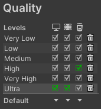
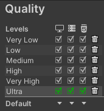

# unity-learn-MyScene1

(2023-12-01)

Unity Learn の

- パスウェイ: Unity Essentials
- プロジェクト: Essentials of real-tirne 3D
- チュートリアル: [Publish your project](https://learn.unity.com/tutorial/publish-your-project)

で、
自分で適当なシーンを作って
ビルドしたり
パブリッシュしたり
するあたりの
つまづきポイント。

Unity Editor は 2021.3 LTS

## WebGL でビルドしようとすると Color Space を直せ、と言われる

> In order to build a player, go to 'Player Settings...'
> Unity Build "to resolve the incompatibility between the Color Space and the current settings."

さすがになんだかわからないので以下のリンクに従う。

[Unity:WebGL で Build ボタンが押せない「In order to build a player,go to ‘Player Settings...’ to resolve the incompatibility between the Color Space and the current settings.」エラーの対処 | 電脳産物](https://dianxnao.com/unity%EF%BC%9Awebgl%E3%81%A7build%E3%83%9C%E3%82%BF%E3%83%B3%E3%81%8C%E6%8A%BC%E3%81%9B%E3%81%AA%E3%81%84%E3%80%8Cin-order-to-build-a-playergo-to-player-settings-to-resolve-the-incompatibility/)

Player setting の Other Settings のところで Auto Graphics API の項目のチェックを外す。

## WebGL でビルドしたものを Node.js の http-server で見ようとすると

> Unable to parse Build/build.framework.js.gz! This can happen if build compression was enabled but web server hosting the content was misconfigured to not serve the file with HTTP Response Header "Content-Encoding: gzip" present. Check browser Console and Devtools Network tab to debug.

と言われる。言ってることはわかるけど...

ひとつの答えは「圧縮しない」。

File \> Publishing Settings \>
Player \> Publishing Settings \> Decompression fallback

gzip,brotli,disable から選べる。
圧縮処理けっこう時間かかるし、テストはこれがいいと思う。

普段は

- 非圧縮を設定
- "build & run" ボタン
  でいいと思う。

で、build 済みのディレクトリを使うには

- 非圧縮
- `http-server ./build` (./build にビルドした場合)

圧縮する場合は
これなんかが参考になる。
[WebGL ビルドしたコンテンツを nginx で配信する](https://egashira.dev/blog/webgl-nginx-server-conf)
結構手の込んだ設定が必要。

パブリッシュする場合はまた話が別。AWS S3 なんかだとオブジェクト単位で指定できるし。

## Unity Editor で WebGL で build すると影がでないのはなぜ?

File \> Publishing Settings \> Quarity のところで

こうなってるのを:  

こうする:  

下の Default ▼ ▼ ▼ の一番右の ▼ をクリックするとプルダウンが出る。

Ultra でなく Very High でも影は出る。
